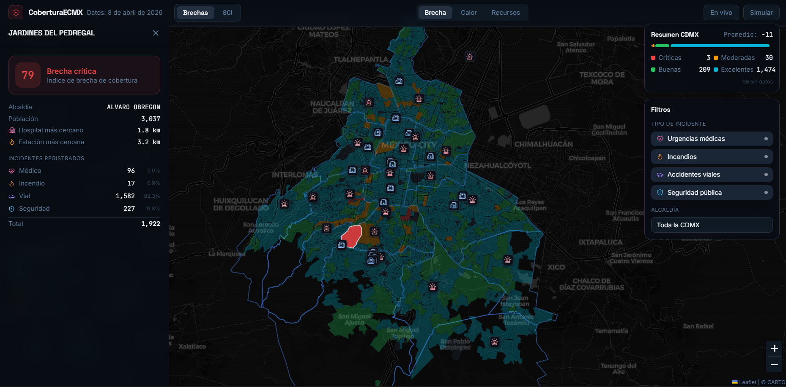
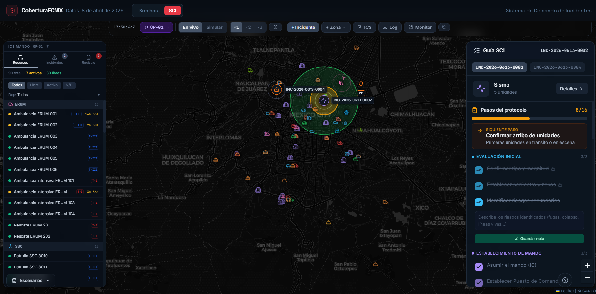
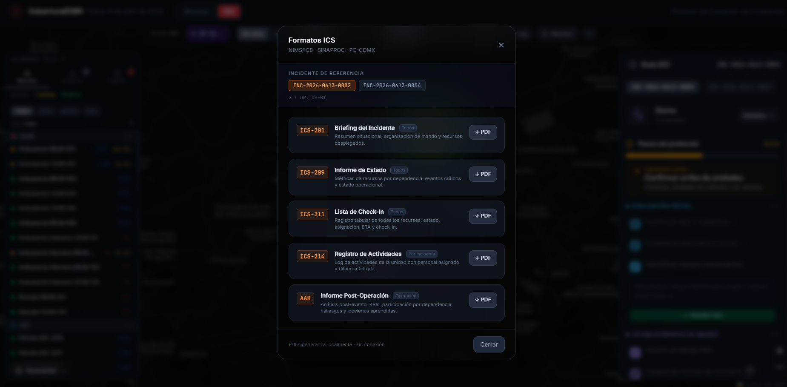

# CoberturaECMX — Análisis de Cobertura de Emergencias y Simulador SCI

DEMO: https://sci-alpha.vercel.app/

> Plataforma dual para la Ciudad de México: análisis de brechas de cobertura de servicios de emergencia por colonia (con datos abiertos reales) + simulador interactivo de Sistema de Comando de Incidentes (SCI/ICS) con escenarios de desastre guionizados.



## Dos modos, una plataforma

### Modo Cobertura — ¿dónde faltan servicios de emergencia?

Analiza las **1,814 colonias de la CDMX** cruzando demanda real contra oferta de servicios:

- **Demanda**: ~894,000 llamadas al 911 (datos abiertos del C5, 2022–2024), agregadas por colonia y tipo de incidente (médico, incendio, vial, seguridad)
- **Oferta**: distancia a hospitales y estaciones de bomberos, densidad de servicios en radio de 3 km
- **Gap score** por colonia: demanda normalizada vs. oferta normalizada, visualizado como coropletas interactivas

Incluye un **simulador de hipótesis**: coloca un hospital o estación de bomberos hipotética en el mapa y observa cómo cambian los scores de las colonias circundantes en tiempo real.

Pipeline de datos reproducible en Python (`scripts/preprocess.py`) a partir de fuentes abiertas: C5, INEGI, CLUES.

### Modo SCI — simulador de comando de incidentes



Simulador interactivo del Sistema de Comando de Incidentes para práctica y demostración de gestión de emergencias urbanas:

- **Escenarios guionizados con narrativa progresiva**: sismo 7.5 Mw con colapsos en cascada, incendios y fuga química — eventos cronometrados con inyección de bitácora estilo CENACOM
- **Motor de despacho por matriz de costos** (operations research, no ML): cada unidad disponible se puntúa para cada incidente combinando idoneidad de capacidades, ETA realista, tipología NIMS y dependencia; un greedy set-cover arma el "paquete de respuesta" recomendado
- **Modelo de ETA calibrado para CDMX**: velocidad por tipo de unidad, factor de tortuosidad vial, horas pico de la ciudad
- **Gestión SCI completa**: zonas (PC, triage, staging, helipuerto), periodos operacionales, checklists por rol, bitácora de eventos con niveles
- **Formatos ICS exportables**: ICS-201, 209, 211, 214 y reporte AAR (After Action Review) en PDF
- **Persistencia local**: autosave, snapshots nombrados de escenarios, export/import JSON para compartir ejercicios
- **PWA offline-capable** con service worker



## Stack

- **React 19** + Vite, **Tailwind CSS**, Framer Motion
- **Leaflet / react-leaflet** + leaflet.heat — mapas y capas
- **Turf.js** — operaciones geoespaciales (point-in-polygon, buffers, centroides)
- **jsPDF** — generación de formatos ICS y reportes
- **Recharts**, PapaParse
- Pipeline de datos: **Python** (pandas)
- Sin backend: datos estáticos pre-procesados + estado en localStorage

## Correr localmente

```bash
npm install
npm run dev
```

Para regenerar los datos desde las fuentes abiertas, ver [`scripts/README.md`](scripts/README.md).

## Fuentes de datos

| Fuente | Uso |
|---|---|
| [C5 CDMX — Llamadas 911](https://datos.cdmx.gob.mx/dataset/llamadas-numero-de-atencion-a-emergencias-911) | Demanda por colonia |
| [INEGI / Datos CDMX — Colonias y alcaldías](https://datos.cdmx.gob.mx/dataset/coloniascdmx) | Geometrías |
| [CLUES — Establecimientos de salud](https://www.gob.mx/salud/documentos/datos-abiertos-190024) | Hospitales |
| Bomberos CDMX | Estaciones (geocodificación propia) |

## Aviso

⚠️ **Proyecto de investigación y portafolio.** El modo SCI es un simulador con fines de práctica y demostración — no es un sistema de despacho operativo. Los gap scores del modo Cobertura son un ejercicio analítico con datos parciales de oferta y no deben usarse para decisiones de política pública sin validación adicional.

## Licencia

Todos los derechos reservados. El código está publicado con fines de portafolio y aprendizaje; contacta a la autora para cualquier otro uso.

